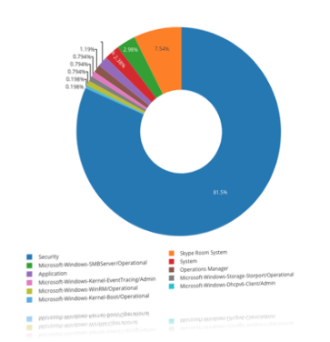

# Universal Winlogbeat configuration

This repository contains a universal [Winlogbeat](https://www.elastic.co/beats/winlogbeat) configuration.

I use this configuration to push Windows EventLogs to [Graylog](https://www.graylog.org), but it should also work for other Beats compatible systems.

I used [NXLog](https://nxlog.co/products/nxlog-community-edition) and decided to switch to [Winlogbeat](https://www.elastic.co/beats/winlogbeat) now.



The configuration is in a very early beta stage!

## Requirements

[Winlogbeat](https://www.elastic.co/beats/winlogbeat) (tested with 7.10.2)

## Info

I did all tests with Windows 10 1809 and 20H2, and Windows Server 2016. in my setup it send everything to a Debian 10 based [Graylog](https://www.graylog.org) Server (4.0.1).

I remove a few fields from each message in my [Graylog](https://www.graylog.org) input via a filter.

## Config

Please be warned: This is a all-in-One solutions, e.g., one size fits all.

```yaml
# Define the output (we use Logstash for Graylog)
output.logstash:
  hosts:
    - "XXX.XXX.XXX.XXX:XXXX"

# Cleanup
path: null

# The amount of time to wait for all events to be published when shutting down.
winlogbeat.shutdown_timeout: 30s

# A list of entries (called dictionaries in YAML) that specify which event logs to monitor.
winlogbeat.event_logs:
  # Application Crashes: https://github.com/palantir/windows-event-forwarding/blob/master/wef-subscriptions/Application-Crashes.xml
  - name: Application
    event_id: 1000, 1002
    ignore_older: 24h
    level: error
    provider:
      - Application Error
      - Application Hang
  - name: Application
    event_id: 1001
    ignore_older: 24h
    level: info
    provider:
      - Windows Error Reporting

  # emet: https://github.com/palantir/windows-event-forwarding/blob/master/wef-subscriptions/EMET.xml
  - name: Application
    event_id: 1, 2
    level: warning, error
    provider:
      - EMET

  # Account Lockout: https://github.com/palantir/windows-event-forwarding/blob/master/wef-subscriptions/Account-Lockout.xml
  - name: Security
    event_id: 4740
    level: info
    ignore_older: 24h
    provider:
      - Microsoft-Windows-Security-Auditing

  # event log diagnostics: https://github.com/palantir/windows-event-forwarding/blob/master/wef-subscriptions/Event-Log-Diagnostics.xml
  - name: System
    ignore_older: 24h
    provider:
      - Microsoft-Windows-Eventlog
  - name: Security
    ignore_older: 24h
    event_id: 1100, 1104, 1105, 1108

  # explicit credentials: https://github.com/palantir/windows-event-forwarding/blob/master/wef-subscriptions/Explicit-Credentials.xml
  - name: Security
    level: info
    ignore_older: 24h
    provider:
      - Microsoft-Windows-Security-Auditing

  # Account Management: https://github.com/palantir/windows-event-forwarding/blob/master/wef-subscriptions/Account-Management.xml
  - name: Security
    event_id: 4627, 4703, 4704, 4705, 4720, 4737-4739, 4780-4782, 4793, 4794, 4798, 4799, 5376, 5377
    ignore_older: 24h
  - name: Security
    event_id: 4722-4735
    ignore_older: 24h
  - name: Security
    event_id: 4741-4753
    ignore_older: 24h
  - name: Security
    event_id: 4754-4767
    ignore_older: 24h

  # Active Directory: https://github.com/palantir/windows-event-forwarding/blob/master/wef-subscriptions/Active-Directory.xml
  - name: Security
    event_id: 4662, 14080, 5136, 5137, 5178, 5139, 5141, 4713, 4706, 4707, 4716, 4717, 4718, 4739, 4864, 4865, 4866, 4867
    ignore_older: 24h

  # Authentication: https://github.com/palantir/windows-event-forwarding/blob/master/wef-subscriptions/Authentication.xml
  - name: Security
    #event_id: 4624-4626, 4634, 4647, 4649, 4672, 4675, 4774-4779, 4800-4803, 4964, 5378
    event_id: 4624-4626, 4647, 4649, 4675, 4774-4779, 4800-4803, 4964, 5378
    ignore_older: 24h

  # autoruns: https://github.com/palantir/windows-event-forwarding/blob/master/wef-subscriptions/Autoruns.xml
  # make sure to set up the scheduled autoruns service
  - name: Autoruns
    ignore_older: 24h

  # bits: https://github.com/palantir/windows-event-forwarding/blob/master/wef-subscriptions/Bits-Client.xml
  - name: Microsoft-Windows-Bits-Client/Operational
    ignore_older: 24h
    processors:
      - drop_event.when.or:
          - equals.winlog.event_id: 3
          - equals.winlog.event_id: 5
          - equals.winlog.event_id: 61
          - equals.winlog.event_id: 16403

  # certificate authority: https://github.com/palantir/windows-event-forwarding/blob/master/wef-subscriptions/Certificate-Authority.xml
  - name: Security
    event_id: 4886, 4887, 4888
    ignore_older: 24h

  # code integrity: https://github.com/palantir/windows-event-forwarding/blob/master/wef-subscriptions/Code-Integrity.xml
  - name: Microsoft-Windows-CodeIntegrity/Operational
    event_id: 3001, 3002, 3003, 3004, 3010, 3023
    ignore_older: 24h
    level: error, warning
    provider:
      - Microsoft-Windows-CodeIntegrity
  - name: Security
    event_id: 5038, 6281, 6410
    ignore_older: 24h
    level: info
    provider:
      - Microsoft-Windows-Security-Auditing

  # drivers: https://github.com/palantir/windows-event-forwarding/blob/master/wef-subscriptions/Drivers.xml
  - name: System
    event_id: 219
    ignore_older: 24h
    level: warning
    provider:
      - Microsoft-Windows-Kernel-PnP
  - name: Microsoft-Windows-DriverFrameworks-UserMode/Operational
    event_id: 2004
    ignore_older: 24h

  - name: System
    level: 'critical, error'
    ignore_older: 24h
    processors:
      - drop_event.when.or:
          - equals.winlog.event_id: 7000
          - equals.winlog.event_id: 7001
          - equals.winlog.event_id: 10016
          - equals.winlog.event_id: 24629
          - equals.winlog.event_id: 10010
          - equals.winlog.event_id: 11060
          - equals.winlog.event_id: 41
          - equals.winlog.event_id: 124
          - equals.winlog.event_id: 34

  # As requested by our external CISO service
  - name: ForwardedEvents
    tags: [forwarded]
    processors:
      - script:
          when.equals.winlog.channel: Security
          lang: javascript
          id: security
          file: ${path.home}/module/security/config/winlogbeat-security.js
      - script:
          when.equals.winlog.channel: Microsoft-Windows-Sysmon/Operational
          lang: javascript
          id: sysmon
          file: ${path.home}/module/sysmon/config/winlogbeat-sysmon.js
      - script:
          when.equals.winlog.channel: Windows PowerShell
          lang: javascript
          id: powershell
          file: ${path.home}/module/powershell/config/winlogbeat-powershell.js
      - script:
          when.equals.winlog.channel: Microsoft-Windows-PowerShell/Operational
          lang: javascript
          id: powershell
          file: ${path.home}/module/powershell/config/winlogbeat-powershell.js

  # exploit guard: https://github.com/palantir/windows-event-forwarding/blob/master/wef-subscriptions/Exploit-Guard.xml
  - name: Microsoft-Windows-Windows Defender/Operational
    event_id: 1121, 1122, 5007
    ignore_older: 24h
  - name: Microsoft-Windows-Windows Defender/WHC
    event_id: 1121, 1122, 5007
    ignore_older: 24h
  - name: Microsoft-Windows-Security-Mitigations/KernelMode
    event_id: 1-9, 11-12, 5, 260
    ignore_older: 24h
    provider:
      - Microsoft-Windows-Security-Mitigations
      - Microsoft-Windows-WER-Diag
      - Microsoft-Windows-Win32kv
      - Win32k
  - name: Microsoft-Windows-Security-Mitigations/KernelMode
    event_id: 12-24
    ignore_older: 24h
    provider:
      - Microsoft-Windows-Security-Mitigations
      - Microsoft-Windows-WER-Diag
      - Microsoft-Windows-Win32kv
      - Win32k
  - name: Microsoft-Windows-Win32k/Concurrency
    event_id: 1-12, 5, 260
    ignore_older: 24h
    provider:
      - Microsoft-Windows-Security-Mitigations
      - Microsoft-Windows-WER-Diag
      - Microsoft-Windows-Win32kv
      - Win32k
  - name: Microsoft-Windows-Win32k/Concurrency
    event_id: 12-24
    ignore_older: 24h
    provider:
      - Microsoft-Windows-Security-Mitigations
      - Microsoft-Windows-WER-Diag
      - Microsoft-Windows-Win32kv
      - Win32k
  - name: Microsoft-Windows-Win32k/Contention
    event_id: 1-12, 5, 260
    ignore_older: 24h
    provider:
      - Microsoft-Windows-Security-Mitigations
      - Microsoft-Windows-WER-Diag
      - Microsoft-Windows-Win32kv
      - Win32k
  - name: Microsoft-Windows-Win32k/Contention
    event_id: 12-24
    ignore_older: 24h
    provider:
      - Microsoft-Windows-Security-Mitigations
      - Microsoft-Windows-WER-Diag
      - Microsoft-Windows-Win32kv
      - Win32k
  - name: Microsoft-Windows-Win32k/Messages
    event_id: 1-12, 5, 260
    ignore_older: 24h
    provider:
      - Microsoft-Windows-Security-Mitigations
      - Microsoft-Windows-WER-Diag
      - Microsoft-Windows-Win32kv
      - Win32k
  - name: Microsoft-Windows-Win32k/Messages
    event_id: 12-24
    ignore_older: 24h
    provider:
      - Microsoft-Windows-Security-Mitigations
      - Microsoft-Windows-WER-Diag
      - Microsoft-Windows-Win32kv
      - Win32k
  - name: Microsoft-Windows-Win32k/Operational
    event_id: 1-12, 5, 260
    ignore_older: 24h
    provider:
      - Microsoft-Windows-Security-Mitigations
      - Microsoft-Windows-WER-Diag
      - Microsoft-Windows-Win32kv
      - Win32k
  - name: Microsoft-Windows-Win32k/Operational
    event_id: 12-24
    ignore_older: 24h
    provider:
      - Microsoft-Windows-Security-Mitigations
      - Microsoft-Windows-WER-Diag
      - Microsoft-Windows-Win32kv
      - Win32k
  - name: Microsoft-Windows-Win32k/Power
    event_id: 1-12, 5, 260
    ignore_older: 24h
    provider:
      - Microsoft-Windows-Security-Mitigations
      - Microsoft-Windows-WER-Diag
      - Microsoft-Windows-Win32kv
      - Win32k
  - name: Microsoft-Windows-Win32k/Power
    event_id: 12-24
    ignore_older: 24h
    provider:
      - Microsoft-Windows-Security-Mitigations
      - Microsoft-Windows-WER-Diag
      - Microsoft-Windows-Win32kv
      - Win32k
  - name: Microsoft-Windows-Win32k/Render
    event_id: 1-12, 5, 260
    ignore_older: 24h
    provider:
      - Microsoft-Windows-Security-Mitigations
      - Microsoft-Windows-WER-Diag
      - Microsoft-Windows-Win32kv
      - Win32k
  - name: Microsoft-Windows-Win32k/Render
    event_id: 12-24
    ignore_older: 24h
    provider:
      - Microsoft-Windows-Security-Mitigations
      - Microsoft-Windows-WER-Diag
      - Microsoft-Windows-Win32kv
      - Win32k
  - name: Microsoft-Windows-Win32k/Tracing
    event_id: 1-12, 5, 260
    ignore_older: 24h
    provider:
      - Microsoft-Windows-Security-Mitigations
      - Microsoft-Windows-WER-Diag
      - Microsoft-Windows-Win32kv
      - Win32k
  - name: Microsoft-Windows-Win32k/Tracing
    event_id: 12-24
    ignore_older: 24h
    provider:
      - Microsoft-Windows-Security-Mitigations
      - Microsoft-Windows-WER-Diag
      - Microsoft-Windows-Win32kv
      - Win32k
  - name: Microsoft-Windows-Win32k/UIPI
    event_id: 1-12, 5, 260
    ignore_older: 24h
    provider:
      - Microsoft-Windows-Security-Mitigations
      - Microsoft-Windows-WER-Diag
      - Microsoft-Windows-Win32kv
      - Win32k
  - name: Microsoft-Windows-Win32k/UIPI
    event_id: 12-24
    ignore_older: 24h
    provider:
      - Microsoft-Windows-Security-Mitigations
      - Microsoft-Windows-WER-Diag
      - Microsoft-Windows-Win32kv
      - Win32k
  - name: System
    event_id: 1-12, 5, 260
    ignore_older: 24h
    provider:
      - Microsoft-Windows-Security-Mitigations
      - Microsoft-Windows-WER-Diag
      - Microsoft-Windows-Win32kv
      - Win32k
  - name: System
    event_id: 12-24
    ignore_older: 24h
    provider:
      - Microsoft-Windows-Security-Mitigations
      - Microsoft-Windows-WER-Diag
      - Microsoft-Windows-Win32kv
      - Win32k
  - name: Microsoft-Windows-Security-Mitigations/UserMode
    event_id: 1-12, 5, 260
    ignore_older: 24h
    provider:
      - Microsoft-Windows-Security-Mitigations
      - Microsoft-Windows-WER-Diag
      - Microsoft-Windows-Win32kv
      - Win32k
  - name: Microsoft-Windows-Security-Mitigations/UserMode
    event_id: 12-24
    ignore_older: 24h
    provider:
      - Microsoft-Windows-Security-Mitigations
      - Microsoft-Windows-WER-Diag
      - Microsoft-Windows-Win32kv
      - Win32k
  - name: Microsoft-Windows-Windows Defender/Operational
    event_id: 1125, 1126, 5007
    ignore_older: 24h
  - name: Microsoft-Windows-Windows Defender/WHC
    event_id: 1125, 1126, 5007
    ignore_older: 24h

  # windows defender: https://github.com/palantir/windows-event-forwarding/blob/master/wef-subscriptions/Windows-Defender.xml
  - name: Microsoft-Windows-Windows Defender/Operational
    event_id: 1006-1009
    ignore_older: 24h
  - name: Microsoft-Windows-Windows Defender/Operational
    event_id: 1116-1119
    ignore_older: 24h

  - name: Microsoft-Windows-AAD/Operational
    level: 'critical, error, warning'
    ignore_older: 24h
    include_xml: true
    processors:
      - drop_event.when.or:
          - equals.winlog.event_id: 1104
          - equals.winlog.event_id: 1025
          - equals.winlog.event_id: 1097
          - equals.winlog.event_id: 1098
          - equals.winlog.event_id: 1162
          - equals.winlog.event_id: 7361

  - name: Microsoft-Windows-BitLocker/BitLocker Operational
    level: 'critical, error, warning'
    ignore_older: 24h

  - name: Microsoft-Windows-BitLocker/BitLocker Management
    level: 'critical, error'
    ignore_older: 24h

  - name: Microsoft-Windows-BitLocker-DrivePreparationTool/Operational
    level: 'critical, error'
    ignore_older: 24h

  - name: Microsoft-Windows-BitLocker-DrivePreparationTool/Admin
    level: 'critical, error'
    ignore_older: 24h

  - name: Microsoft-Windows-DeviceGuard/Operational
    level: 'critical, error'
    ignore_older: 24h

  - name: Microsoft-Windows-DSC/Operational
    level: 'critical, error'
    ignore_older: 24h

  - name: Microsoft-Windows-PowerShell/Operational
    event_id: 4103, 4105, 4106
    level: 'critical, error, warning'
    ignore_older: 24h
    processors:
      - drop_event.when.or:
          - equals.winlog.event_id: 4104
          - equals.winlog.event_id: 4100
          - equals.winlog.event_id: 32784

  - name: Microsoft-Windows-PowerShell/Admin
    level: 'critical, error'
    ignore_older: 24h

  - name: Microsoft-Windows-PowerShell-DesiredStateConfiguration-FileDownloadManager/Operational
    level: 'critical, error'
    ignore_older: 24h

  - name: Microsoft-Windows-Shell-Core/Operational
    level: 'critical, error'
    ignore_older: 24h

  - name: Microsoft-Windows-Shell-Core/LogonTasksChannel
    level: 'critical, error'
    ignore_older: 24h

  - name: Microsoft-Windows-Shell-Core/AppDefaults
    level: 'critical, error'
    ignore_older: 24h

  - name: Microsoft-Windows-Shell-Core/ActionCenter
    level: 'critical, error'
    ignore_older: 24h

  - name: PowerShellCore/Operational
    level: 'critical, error, warning'
    ignore_older: 24h

  - name: OpenSSH/Operational
    level: 'critical, error, warning'
    ignore_older: 24h

  - name: OpenSSH/Admin
    level: 'critical, error, warning'
    ignore_older: 24h

  - name: HardwareEvents
    level: 'critical, error'
    ignore_older: 24h

  - name: Windows PowerShell
    event_id: 400, 403, 600, 800
    level: 'critical, error, warning'
    ignore_older: 24h

  - name: Microsoft-Windows-WMI-Activity/Operational
    #event_id: 5857,5858,5859,5860,5861
    level: 'critical, error'
    ignore_older: 24h
    processors:
      - drop_event.when.or:
          - equals.winlog.event_id: 5858

  - name: Microsoft-Windows-TPM-WMI
    level: 'critical, error'
    ignore_older: 24h

  - name: Microsoft-Windows-Security-Mitigations/KernelMode
    level: 'critical, error'
    ignore_older: 24h
    processors:
      - drop_event.when.or:
          - equals.winlog.event_id: 10

  - name: Microsoft-Windows-Security-Mitigations/UserMode
    level: 'critical, error'
    ignore_older: 24h

  - name: Microsoft-Windows-Kernel-WHEA/Operational
    level: 'critical, error'
    ignore_older: 24h

  - name: Microsoft-Windows-Kernel-WHEA/Errors
    level: 'critical, error'
    ignore_older: 24h

  - name: Microsoft-Windows-Kernel-WDI/Operational
    level: 'critical, error'
    ignore_older: 24h

  - name: Microsoft-Windows-Kernel-StoreMgr/Operational
    level: 'critical, error'
    ignore_older: 24h

  - name: Microsoft-Windows-Kernel-ShimEngine/Operational
    level: 'critical, error'
    ignore_older: 24h

  - name: Microsoft-Windows-Kernel-Power/Thermal-Operational
    level: 'critical, error'
    ignore_older: 24h

  - name: Microsoft-Windows-Kernel-PnP/Driver Watchdog
    level: 'critical, error'
    ignore_older: 24h

  - name: Microsoft-Windows-Kernel-PnP/Configuration
    level: 'critical, error'
    ignore_older: 24h

  - name: Microsoft-Windows-Kernel-LiveDump/Operational
    level: 'critical, error'
    ignore_older: 24h

  - name: Microsoft-Windows-Kernel-IO/Operational
    level: 'critical, error'
    ignore_older: 24h

  - name: Microsoft-Windows-Kernel-EventTracing/Admin
    level: 'critical, error'
    ignore_older: 24h
    processors:
      - drop_event.when.or:
          - equals.winlog.event_id: 1569
          - equals.winlog.event_id: 1570
          - equals.winlog.event_id: 2
          - equals.winlog.event_id: 28
          - contains.message: 'Session "Diagtrack-Listener" stopped due to the following error:'

  - name: Microsoft-Windows-Kernel-Boot/Operational
    level: 'critical, error'
    ignore_older: 24h
    processors:
      - drop_event.when.or:
          - equals.winlog.event_id: 124
          - equals.winlog.event_id: 158

  - name: Microsoft-Windows-WinRM/Operational
    level: 'critical, error, warning'
    ignore_older: 24h
    processors:
      - drop_event.when.or:
          - equals.winlog.event_id: 142
          - equals.winlog.event_id: 161

  - name: Microsoft-Windows-RemoteDesktopServices-RdpCoreTS/Operational
    level: 'critical, error'
    ignore_older: 24h
    processors:
      - drop_event.when.or:
          - equals.winlog.event_id: 227

  - name: Microsoft-Windows-RemoteDesktopServices-RdpCoreTS/Admin
    level: 'critical, error'
    ignore_older: 24h

  - name: Microsoft-Windows-Windows Firewall With Advanced Security/Firewall
    level: 'critical, error'
    ignore_older: 24h
    include_xml: true

  - name: Microsoft-Windows-Windows Firewall With Advanced Security/ConnectionSecurity
    level: 'critical, error'
    ignore_older: 24h
    include_xml: true

  - name: Windows Networking Vpn Plugin Platform/Operational
    level: 'critical, error'
    ignore_older: 24h

  - name: Microsoft-Windows-VPN/Operational
    level: 'critical, error'
    ignore_older: 24h

  - name: Microsoft-Windows-VPN-Client/Operational
    level: 'critical, error'
    ignore_older: 24h

  - name: Microsoft-Windows-RasAgileVpn/Operational
    level: 'critical, error'
    ignore_older: 24h

  - name: Microsoft-Windows-TCPIP/Operational
    level: 'critical, error'
    ignore_older: 24h

  - name: Microsoft-Windows-LiveId/Operational
    level: 'critical, error'
    ignore_older: 24h
    processors:
      - drop_event.when.or:
          - equals.winlog.event_id: 2028
          - equals.winlog.event_id: 6113
          - equals.winlog.event_id: 6114

  - name: Microsoft-Windows-ReFS/Operational
    level: 'critical, error'
    ignore_older: 24h

  - name: Microsoft-Windows-GroupPolicy/Operational
    level: 'critical, error, warning'
    ignore_older: 24h

  - name: Microsoft-Windows-HelloForBusiness/Operational
    level: 'critical, error, warning'
    ignore_older: 24h
    processors:
      - drop_event.when.or:
          # Failed prerequisites check, who cares?
          - equals.winlog.event_id: 7054
          # Failed with hardware requirements, who cares?
          - equals.winlog.event_id: 7202
          # User running in a remote desktop session
          - equals.winlog.event_id: 7210
          # Requirement check failed
          - equals.winlog.event_id: 7201

  # task scheduler: https://github.com/palantir/windows-event-forwarding/blob/master/wef-subscriptions/Task-Scheduler.xml
  - name: Microsoft-Windows-TaskScheduler/Operational
    event_id: 106, 129, 141, 142, 200, 201
    ignore_older: 24h
    provider:
      - Microsoft-Windows-TaskScheduler
  - name: Security
    event_id: 4698-4702
    ignore_older: 24h

  - name: Microsoft-Windows-TaskScheduler/Maintenance
    level: 'critical, error'
    ignore_older: 24h

  - name: Microsoft-Windows-Storsvc/Diagnostic
    level: 'critical, error'
    ignore_older: 24h

  - name: Microsoft-Windows-Store/Operational
    level: 'critical'
    ignore_older: 24h
    processors:
      - drop_event.when.or:
          - equals.winlog.event_id: 8002

  - name: Microsoft-Windows-StorageSpaces-SpaceManager/Operational
    level: 'critical, error'
    ignore_older: 24h

  - name: Microsoft-Windows-StorageSpaces-SpaceManager/Diagnostic
    level: 'critical, error'
    ignore_older: 24h

  - name: Microsoft-Windows-StorageSpaces-ManagementAgent/WHC
    level: 'critical, error'
    ignore_older: 24h

  - name: Microsoft-Windows-StorageSpaces-Driver/Operational
    level: 'critical, error'
    ignore_older: 24h

  - name: Microsoft-Windows-StorageSpaces-Driver/Diagnostic
    level: 'critical, error'
    ignore_older: 24h

  - name: Microsoft-Windows-StorageManagement/Operational
    level: 'critical, error'
    ignore_older: 24h

  - name: Microsoft-Windows-Storage-Tiering/Admin
    level: 'critical, error'
    ignore_older: 24h

  - name: Microsoft-Windows-Storage-Storport/Operational
    level: 'critical'
    ignore_older: 24h
    processors:
      - drop_event.when.or:
          - equals.winlog.event_id: 549
          - equals.winlog.event_id: 534
          - equals.winlog.event_id: 523
          - equals.winlog.event_id: 500

  - name: Microsoft-Windows-Storage-Storport/Health
    level: 'critical, error'
    ignore_older: 24h

  - name: Microsoft-Windows-Storage-Storport/Admin
    level: 'critical, error'
    ignore_older: 24h

  - name: Microsoft-Windows-Storage-Disk/Operational
    level: 'critical, error'
    ignore_older: 24h

  - name: Microsoft-Windows-Storage-Disk/Admin
    level: 'critical, error'
    ignore_older: 24h

  - name: Microsoft-Windows-SMBServer/Security
    level: 'critical, error'
    ignore_older: 24h

  - name: Microsoft-Windows-SMBServer/Operational
    level: 'critical, error'
    ignore_older: 24h
    processors:
      - drop_event.when.or:
          - equals.winlog.event_id: 1024

  - name: Microsoft-Windows-SMBServer/Connectivity
    level: 'critical, error'
    ignore_older: 24h

  - name: Microsoft-Windows-SMBServer/Audit
    level: 'critical, error'
    ignore_older: 24h

  - name: Microsoft-Windows-SmbClient/Security
    level: 'critical, error'
    ignore_older: 24h
    processors:
      - drop_event.when.or:
          - equals.winlog.event_id: 8464
          - equals.winlog.event_id: 31001

  - name: Microsoft-Windows-SMBClient/Operational
    level: 'critical, error'
    ignore_older: 24h

  - name: Microsoft-Windows-SmbClient/Connectivity
    level: 'critical, error'
    ignore_older: 24h
    processors:
      - drop_event.when.or:
          - equals.winlog.event_id: 30800
          - equals.winlog.event_id: 30803

  - name: Microsoft-Windows-SmbClient/Audit
    level: 'critical, error'
    ignore_older: 24h

  - name: Win Device Agent
    level: 'critical, error'
    ignore_older: 24h

  - name: ScriptLaunch
    level: 'critical, error'
    ignore_older: 24h

  - name: Operations Manager
    level: 'critical, error'
    ignore_older: 24h
    processors:
      - drop_event.when.or:
          - equals.winlog.event_id: 4502
          - equals.winlog.event_id: 26002

  - name: OneApp_IGCC
    level: 'critical, error'
    ignore_older: 24h

  - name: Key Management Service
    level: 'critical, error'
    ignore_older: 24h

  - name: Internet Explorer
    level: 'critical, error'
    ignore_older: 24h

  # dns: https://github.com/palantir/windows-event-forwarding/blob/master/wef-subscriptions/DNS.xml
  - name: Microsoft-Windows-DNS-Client/Operational
    event_id: 3008
    ignore_older: 24h
  - name: DNS Server
    event_id: 150, 770
    ignore_older: 24h
  - name: Microsoft-Windows-DNSServer/Audit
    event_id: 541
    ignore_older: 24h

  - name: Microsoft-Windows-Dhcpv6-Client/Operational
    level: 'critical, error'
    ignore_older: 24h

  - name: Microsoft-Windows-Dhcpv6-Client/Admin
    level: 'critical, error'
    ignore_older: 24h

  - name: Microsoft-Windows-Dhcp-Client/Operational
    level: 'critical, error'
    ignore_older: 24h

  - name: Microsoft-Windows-Dhcp-Client/Admin
    level: 'critical, error'
    ignore_older: 24h

  - name: Microsoft-Windows-AppLocker/Packaged app-Execution
    level: 'critical, error'
    ignore_older: 24h

  - name: Microsoft-Windows-AppLocker/Packaged app-Deployment
    level: 'critical, error'
    ignore_older: 24h

  - name: Microsoft-Windows-AppLocker/MSI and Script
    level: 'critical, error'
    ignore_older: 24h

  - name: Microsoft-Windows-AppLocker/EXE and DLL
    level: 'critical, error'
    ignore_older: 24h

  - name: Microsoft-Windows-CodeIntegrity/Operational
    level: 'critical'
    ignore_older: 24h
    processors:
      - drop_event.when.or:
          - equals.winlog.event_id: 3033

  # Server only
  - name: Microsoft-Windows-Dhcp-Server/Operational
    level: 'critical, error'
    ignore_older: 24h

  # Microsoft Skype for Business Rooms System and Microsoft Teams Rooms System only
  - name: Skype Room System
    level: 'critical, error, warning'
    ignore_older: 24h

  # Hp Tooling
  - name: HPNotifications Application
    level: 'critical, error'
    ignore_older: 24h

  - name: HP Sure Start
    level: 'critical, error'
    ignore_older: 24h

  - name: HP Diagnostics
    level: 'critical, error'
    ignore_older: 24h

  - name: HP Analytics
    level: 'critical, error'
    ignore_older: 24h

  # Hyper-V only
  - name: Microsoft-Windows-Hyper-V-Hypervisor-Operational
    level: 'critical, error'
    ignore_older: 24h
    processors:
      - drop_event.when.or:
          - equals.winlog.event_id: 41

  - name: Microsoft-Windows-Hyper-V-Hypervisor-Admin
    level: 'critical, error'
    ignore_older: 24h
    processors:
      - drop_event.when.or:
          - equals.winlog.event_id: 41

  - name: Microsoft-Windows-Hyper-V-Worker-Operational
    level: 'critical, error'
    ignore_older: 24h

  - name: Microsoft-Windows-Hyper-V-Worker-Admin
    level: 'critical, error'
    ignore_older: 24h

  - name: Microsoft-Windows-Hyper-V-VmSwitch-Operational
    level: 'critical, error'
    ignore_older: 24h

  - name: Microsoft-Windows-Hyper-V-VID-Admin
    level: 'critical, error'
    ignore_older: 24h

  - name: Microsoft-Windows-Hyper-V-StorageVSP-Admin
    level: 'critical, error'
    ignore_older: 24h

  - name: Microsoft-Windows-Hyper-V-Guest-Drivers/Operational
    level: 'critical, error'
    ignore_older: 24h

  - name: Microsoft-Windows-Hyper-V-Guest-Drivers/Admin
    level: 'critical, error'
    ignore_older: 24h

  - name: Microsoft-Windows-Hyper-V-Compute-Operational
    level: 'critical, error'
    ignore_older: 24h

  - name: Microsoft-Windows-Hyper-V-Compute-Admin
    level: 'critical, error'
    ignore_older: 24h

  # Monitor USB Devices, this eventlog is not enabled by default
  - name: Microsoft-Windows-DriverFrameworks-UserMode/Operational
    level: 'critical, error'
    event_id: 2003,2102
    ignore_older: 24h

  # Sysmon related, need some care soon. It IS VERY NOISY, we need a solic filter
  - name: Microsoft-Windows-Sysmon/Operational
    level: 'critical, error, warning, information'
    # Minimum, for now!
    event_id: 255, 16, 14, 6
    ignore_older: 24h

  # HostGuardianService related
  - name: Microsoft-Windows-HostGuardianService-Client/Operational
    level: 'critical, error, warning'
    ignore_older: 24h

  - name: Microsoft-Windows-HostGuardianService-Client/Admin
    level: 'critical, error'
    ignore_older: 24h

  - name: Microsoft-Windows-HostGuardianService-CA/Operational
    level: 'critical, error'
    ignore_older: 24h

  - name: Microsoft-Windows-HostGuardianService-CA/Admin
    level: 'critical, error'
    ignore_older: 24h

  # NTFS
  - name: Microsoft-Windows-Ntfs/WHC
    level: 'critical, error'
    ignore_older: 24h

  - name: Microsoft-Windows-Ntfs/Operational
    level: 'critical, error'
    ignore_older: 24h

  # NTLM
  - name: Microsoft-Windows-NTLM/Operational
    level: 'critical, error'
    ignore_older: 24h

  # ReFS
  - name: Microsoft-Windows-ReFS/Operational
    level: 'critical, error'
    ignore_older: 24h

  # RemoteFX related
  - name: RemoteDesktopServices-RemoteFX-SessionLicensing-Operational
    level: 'critical, error'
    ignore_older: 24h

  - name: RemoteDesktopServices-RemoteFX-SessionLicensing-Admin
    level: 'critical, error'
    ignore_older: 24h

  - name: Microsoft-Windows-RemoteDesktopServices-RemoteFX-Synth3dvsp/Admin
    level: 'critical, error'
    ignore_older: 24h

  - name: Microsoft-Windows-RemoteDesktopServices-RemoteFX-Synth3dvsc/Admin
    level: 'critical, error'
    ignore_older: 24h

  - name: Microsoft-Windows-RemoteDesktopServices-RemoteFX-Manager/Operational
    level: 'critical, error'
    ignore_older: 24h

  - name: Microsoft-Windows-RemoteDesktopServices-RemoteFX-Manager/Admin
    level: 'critical, error'
    ignore_older: 24h

  # General Remote Desktop and App related
  - name: Microsoft-Windows-Remotefs-Rdbss/Operational
    level: 'critical, error'
    ignore_older: 24h

  - name: Microsoft-Windows-RemoteDesktopServices-SessionServices/Operational
    level: 'critical, error, warning'
    ignore_older: 24h

  - name: Microsoft-Windows-RemoteApp and Desktop Connections/Operational
    level: 'critical, error, warning'
    ignore_older: 24h

  - name: Microsoft-Windows-RemoteApp and Desktop Connections/Admin
    level: 'critical, error'
    ignore_older: 24h

  # RemoteAssistance
  - name: Microsoft-Windows-RemoteAssistance/Operational
    level: 'critical, error, warning'
    ignore_older: 24h

  - name: Microsoft-Windows-RemoteAssistance/Admin
    level: 'critical, error'
    ignore_older: 24h

  # RemoteAccess Management Client
  - name: Microsoft-Windows-RemoteAccess-MgmtClientPerf/Operational
    level: 'critical, error'
    ignore_older: 24h

  - name: Microsoft-Windows-RemoteAccess-MgmtClient/Operational
    level: 'critical, error'
    ignore_older: 24h

  # RRAS
  - name: Microsoft-Windows-RRAS/Operational
    level: 'critical, error'
    ignore_older: 24h

  # VPN related
  - name: Windows Networking Vpn Plugin Platform/OperationalVerbose
    level: 'critical, error'
    ignore_older: 24h

  - name: Windows Networking Vpn Plugin Platform/Operational
    level: 'critical, error'
    ignore_older: 24h

  - name: Microsoft-Windows-VPN/Operational
    level: 'critical, error, warning'
    ignore_older: 24h

  - name: Microsoft-Windows-VPN-Client/Operational
    level: 'critical, error'
    ignore_older: 24h

  - name: Microsoft-Windows-RasAgileVpn/Operational
    level: 'critical, error'
    ignore_older: 24h

  # DeviceSync
  - name: Microsoft-Windows-DeviceSync/Operational
    level: 'critical, error'
    ignore_older: 24h

  # SettingSync
  - name: Microsoft-Windows-SettingSync/Operational
    level: 'critical, error'
    ignore_older: 24h

  - name: Microsoft-Windows-SettingSync/Debug
    level: 'critical'
    ignore_older: 24h

  # SettingSync OneDrive
  - name: Microsoft-Windows-SettingSync-OneDrive/Operational
    level: 'critical, error'
    ignore_older: 24h

  - name: Microsoft-Windows-SettingSync-OneDrive/Debug
    level: 'critical, error'
    ignore_older: 24h

  # SettingSync Azure
  - name: Microsoft-Windows-SettingSync-Azure/Operational
    level: 'critical, error'
    ignore_older: 24h

  - name: Microsoft-Windows-SettingSync-Azure/Debug
    level: 'critical, error'
    ignore_older: 24h

  # As request by dennis
  - name: Microsoft-Windows-Security-ExchangeActiveSyncProvisioning/Operational
    level: 'critical, error'
    ignore_older: 24h

  # SmartCard TPM
  - name: Microsoft-Windows-SmartCard-TPM-VCard-Module/Operational
    level: 'critical, error, warning'
    ignore_older: 24h

  - name: Microsoft-Windows-SmartCard-TPM-VCard-Module/Admin
    level: 'critical, error'
    ignore_older: 24h

  # SmartCard Infos
  - name: Microsoft-Windows-SmartCard-DeviceEnum/Operational
    level: 'critical, error'
    ignore_older: 24h

  # SmartCard Authentication
  - name: Microsoft-Windows-SmartCard-Audit/Authentication
    level: 'critical, error, warning'
    ignore_older: 24h

  # TerminalServices
  - name: Microsoft-Windows-TerminalServices-ServerUSBDevices/Operational
    level: 'critical, error'
    ignore_older: 24h

  - name: Microsoft-Windows-TerminalServices-ServerUSBDevices/Admin
    level: 'critical, error'
    ignore_older: 24h

  - name: Microsoft-Windows-TerminalServices-RemoteConnectionManager/Operational
    level: 'critical, error'
    ignore_older: 24h

  - name: Microsoft-Windows-TerminalServices-RemoteConnectionManager/Admin
    level: 'critical, error'
    ignore_older: 24h

  - name: Microsoft-Windows-TerminalServices-RDPClient/Operational
    level: 'critical, error'
    ignore_older: 24h

  - name: Microsoft-Windows-TerminalServices-Printers/Operational
    level: 'critical, error'
    ignore_older: 24h

  - name: Microsoft-Windows-TerminalServices-Printers/Admin
    level: 'critical, error'
    ignore_older: 24h

  - name: Microsoft-Windows-TerminalServices-PnPDevices/Operational
    level: 'critical, error'
    ignore_older: 24h

  - name: Microsoft-Windows-TerminalServices-PnPDevices/Admin
    level: 'critical, error'
    ignore_older: 24h

  - name: Microsoft-Windows-TerminalServices-LocalSessionManager/Operational
    level: 'critical, error'
    ignore_older: 24h

  - name: Microsoft-Windows-TerminalServices-LocalSessionManager/Admin
    level: 'critical, error'
    ignore_older: 24h

  - name: Microsoft-Windows-TerminalServices-ClientUSBDevices/Operational
    level: 'critical, error'
    ignore_older: 24h

  - name: Microsoft-Windows-TerminalServices-ClientUSBDevices/Admin
    level: 'critical, error'
    ignore_older: 24h

  - name: Microsoft-Windows-TerminalServices-Gateway/Admin
    level: 'critical, error'
    ignore_older: 24h

  - name: Microsoft-Windows-TerminalServices-Gateway/Operational
    level: 'critical, error'
    ignore_older: 24h

  - name: Microsoft-Windows-CloudStore/Operational
    level: 'critical, error'
    ignore_older: 24h
    processors:
      - drop_event.when.or:
          # 1 is a very generic error, mostly onecoreuap\shell\cloudstore\store\cache\src\cloudcacheinitializer.cpp and it IS to noisy
          - equals.winlog.event_id: 1

  - name: Microsoft-Windows-CloudStore/Debug
    level: 'critical, error'
    ignore_older: 24h

  - name: Microsoft-Client-Licensing-Platform/Admin
    level: 'critical, error'
    ignore_older: 24h

  - name: Microsoft-Windows-WebAuthN/Operational
    level: 'critical, error'
    ignore_older: 24h

  - name: Microsoft-Windows-Winlogon/Operational
    level: 'critical, error'
    ignore_older: 24h

  #windows update: https://github.com/palantir/windows-event-forwarding/blob/master/wef-subscriptions/Windows-Updates.xml
  - name: Microsoft-Windows-WindowsUpdateClient/Operational
    event_id: 19, 20, 24, 25, 31, 34, 35
    ignore_older: 24h
    level: error
    provider:
      - Microsoft-Windows-WindowsUpdateClient
  - name: Setup
    event_id: 1009
    ignore_older: 24h
    level: info
    provider:
      - Microsoft-Windows-Servicing

  - name: Microsoft-Windows-User Profile Service/Operational
    level: 'critical, error'
    ignore_older: 24h

  - name: Microsoft-Windows-User Device Registration/Admin
    level: 'critical, error'
    ignore_older: 24h

  - name: Microsoft-Windows-Time-Service/Operational
    level: 'critical, error'
    ignore_older: 24h

  # external devices: https://github.com/palantir/windows-event-forwarding/blob/master/wef-subscriptions/External-Devices.xml
  - name: Microsoft-Windows-Kernel-PnP/Configuration
    event_id: 400, 410
    ignore_older: 24h
    level: info
    provider:
      - Microsoft-Windows-Kernel-PnP
  - name: Security
    event_id: 6416
    ignore_older: 24h
  - name: Security
    event_id: 6419-6424
    ignore_older: 24h

  # firewall: https://github.com/palantir/windows-event-forwarding/blob/master/wef-subscriptions/Firewall.xml
  - name: Microsoft-Windows-Windows Firewall With Advanced Security/Firewall
    event_id: 2004, 2005, 2006, 2033
    ignore_older: 24h
    level: info, error
    provider:
      - Microsoft-Windows-Windows Firewall With Advanced Security
  - name: Security
    event_id: 4944-4954
    ignore_older: 24h
  - name: Security
    event_id: 4956-4958
    ignore_older: 24h
  - name: Security
    event_id: 5024, 5025, 5037
    ignore_older: 24h
  - name: Security
    event_id: 5027-5030
    ignore_older: 24h
  - name: Security
    event_id: 5032-5035
    ignore_older: 24h

  # gpo errors: https://github.com/palantir/windows-event-forwarding/blob/master/wef-subscriptions/Group-Policy-Errors.xml
  - name: System
    event_id: 1085, 1125, 1127, 1129
    ignore_older: 24h
    level: error
    provider:
      - Microsoft-Windows-GroupPolicy
  - name: Security
    event_id: 6144, 6145
    ignore_older: 24h

  # kerberos: https://github.com/palantir/windows-event-forwarding/blob/master/wef-subscriptions/Kerberos.xml
  - name: Security
    event_id: 4768, 4769, 4770, 4771, 4772, 4773
    ignore_older: 24h

  # log deletion security: https://github.com/palantir/windows-event-forwarding/blob/master/wef-subscriptions/Log-Deletion-Security.xml
  - name: Security
    event_id: 1102
    ignore_older: 24h
    level: info
    provider:
      - Microsoft-Windows-Eventlog

  # log deletion system: https://github.com/palantir/windows-event-forwarding/blob/master/wef-subscriptions/Log-Deletion-System.xml
  - name: System
    event_id: 104
    ignore_older: 24h
    level: info
    provider:
      - Microsoft-Windows-Eventlog

  # msi: https://github.com/palantir/windows-event-forwarding/blob/master/wef-subscriptions/MSI-Packages.xml
  - name: Application
    event_id: 1022, 1033
    ignore_older: 24h
    provider:
      - MsiInstaller
  - name: Setup
    event_id: 2, 0
    ignore_older: 24h
    provider:
      - Microsoft-Windows-Servicing
  - name: Microsoft-Windows-Application-Experience/Program-Inventory
    event_id: 903, 904
    ignore_older: 24h
    provider:
      - Microsoft-Windows-Application-Experience
  - name: Microsoft-Windows-Application-Experience/Program-Inventory
    event_id: 905, 906
    ignore_older: 24h
    provider:
      - Microsoft-Windows-Application-Experience
  - name: Microsoft-Windows-Application-Experience/Program-Inventory
    event_id: 907, 908
    ignore_older: 24h
    provider:
      - Microsoft-Windows-Application-Experience
  - name: Microsoft-Windows-Application-Experience/Program-Inventory
    event_id: 800
    ignore_older: 24h
    provider:
      - Microsoft-Windows-Application-Experience

  # office: https://github.com/palantir/windows-event-forwarding/blob/master/wef-subscriptions/Microsoft-Office.xml
  - name: OAlerts
    ignore_older: 24h

  # ntml: https://github.com/palantir/windows-event-forwarding/blob/master/wef-subscriptions/NTLM.xml
  - name: Microsoft-Windows-Authentication/AuthenticationPolicyFailures-DomainController
    ignore_older: 24h
    provider:
      - Microsoft-Windows-NTLM
  - name: Microsoft-Windows-Authentication/ProtectedUserFailures-DomainController
    ignore_older: 24h
    provider:
      - Microsoft-Windows-NTLM
  - name: Microsoft-Windows-NTLM/Operational
    ignore_older: 24h
    provider:
      - Microsoft-Windows-NTLM

  # object manipulation: https://github.com/palantir/windows-event-forwarding/blob/master/wef-subscriptions/Object-Manipulation.xml
  - name: Security
    event_id: 4715, 4817, 4656, 4658, 4660, 4663, 4670
    ignore_older: 24h

  # operating system: https://github.com/palantir/windows-event-forwarding/blob/master/wef-subscriptions/Operating-System.xml
  - name: System
    event_id: 12, 13
    ignore_older: 24h
    provider:
      - Microsoft-Windows-Kernel-General
  - name: Security
    event_id: 4608
    ignore_older: 24h
  - name: System
    event_id: 1074
    ignore_older: 24h
    provider:
      - USER32
  - name: Security
    event_id: 4817, 4826
    ignore_older: 24h
  - name: System
    event_id: 16962, 16965, 16968, 16969
    ignore_older: 24h
  - name: Microsoft-Windows-SMBServer/Audit
    event_id: 3000
    ignore_older: 24h
    provider:
      - Microsoft-Windows-SMBServer
  - name: System
    event_id: 41, 1001, 6008, 4621
    ignore_older: 24h
  - name: Security
    event_id: 4610, 4611, 4614, 4622, 4697
    ignore_older: 24h
  - name: Security
    event_id: 4719, 4817, 4902, 4906, 4908, 4912, 4904, 4905
    ignore_older: 24h

  # print: https://github.com/palantir/windows-event-forwarding/blob/master/wef-subscriptions/Print.xml
  - name: Microsoft-Windows-PrintService/Operational
    event_id: 307
    ignore_older: 24h
    level: info
    provider:
      - Microsoft-Windows-PrintService

  # privilege use: https://github.com/palantir/windows-event-forwarding/blob/master/wef-subscriptions/Privilege-Use.xml
  - name: Security
    event_id: 4673, 4674, 4985
    ignore_older: 24h

  # process exec: https://github.com/palantir/windows-event-forwarding/blob/master/wef-subscriptions/Process-Execution.xml
  #- name: Security
  #  event_id: 4688
  #  ignore_older: 24h
  - name: Security
    event_id: 4689
    ignore_older: 24h

  # registry: https://github.com/palantir/windows-event-forwarding/blob/master/wef-subscriptions/Registry.xml
  # TODO: how to filter on eventdata operationtype?
  - name: Security
    event_id: 4657
    ignore_older: 24h

  # services: https://github.com/palantir/windows-event-forwarding/blob/master/wef-subscriptions/Services.xml
  - name: System
    event_id: 7022, 7023, 7024, 7026, 7031, 7032, 7034
    ignore_older: 24h
    level: info, critical, error, warning
    provider:
      - Service Control Manager
  - name: System
    event_id: 7045, 7040
    ignore_older: 24h
    level: info, critical, error, warning
    provider:
      - Service Control Manager

  # shares: https://github.com/palantir/windows-event-forwarding/blob/master/wef-subscriptions/Shares.xml
  - name: Security
    event_id: 5140, 5142, 5144, 5145, 5168
    ignore_older: 24h
  - name: Microsoft-Windows-SMBClient/Operational
    event_id: 30622, 30624
    ignore_older: 24h

  # software restrictions: https://github.com/palantir/windows-event-forwarding/blob/master/wef-subscriptions/Software-Restriction-Policies.xml
  - name: Application
    event_id: 865, 866, 867, 868, 882
    ignore_older: 24h
    provider:
      - Microsoft-Windows-SoftwareRestrictionPolicies

# General processors
processors:
  - add_host_metadata: ~
  - add_cloud_metadata: ~
  - add_docker_metadata: ~

# Add JS Infos
processors:
  - script:
			when.equals.winlog.channel: Security
			lang: javascript
			id: security
			file: ${path.home}/module/security/config/winlogbeat-security.js
processors:
  - script:
			when.equals.winlog.channel: Microsoft-Windows-Sysmon/Operational
			lang: javascript
			id: sysmon
			file: ${path.home}/module/sysmon/config/winlogbeat-sysmon.js
processors:
  - script:
			when.equals.winlog.channel: Microsoft-Windows-Sysmon
			lang: javascript
			id: sysmon
			file: ${path.home}/module/sysmon/config/winlogbeat-sysmon.js
  - script:
			when.equals.winlog.channel: Windows PowerShell
			lang: javascript
			id: powershell
			file: ${path.home}/module/powershell/config/winlogbeat-powershell.js
  - script:
			when.equals.winlog.channel: Microsoft-Windows-PowerShell/Operational
			lang: javascript
			id: powershell
			file: ${path.home}/module/powershell/config/winlogbeat-powershell.js
  - script:
			when.equals.winlog.channel: Microsoft-Windows-PowerShell/Admin
			lang: javascript
			id: powershell
			file: ${path.home}/module/powershell/config/winlogbeat-powershell.js
  - script:
			when.equals.winlog.channel: Microsoft-Windows-PowerShell
			lang: javascript
			id: powershell
			file: ${path.home}/module/powershell/config/winlogbeat-powershell.js
  - script:
			when.equals.winlog.channel: Microsoft-Windows-Shell-Core
			lang: javascript
			id: powershell
			file: ${path.home}/module/powershell/config/winlogbeat-powershell.js
  - script:
			when.equals.winlog.channel: PowerShellCore/Operational
			lang: javascript
			id: powershell
			file: ${path.home}/module/powershell/config/winlogbeat-powershell.js
  - script:
			when.equals.winlog.channel: PowerShellCore
			lang: javascript
			id: powershell
			file: ${path.home}/module/powershell/config/winlogbeat-powershell.js
```

You will find this config as [winlogbeat.yml](assets/winlogbeat.yml) in the [assets](assets) directory!

### Sysmon

Sysmon can provide a lot of information! That is great, but it can become very noisy to!!!

My own Sysmon config is very, very, Noisy. It still needs a bit of care and a lot of filtering.

Therefore I placed the `level:` in the Sysmon section. It will not even try to log something towards Graylog! Comment out this thine with an `#` and you will get all the Information, based on your Sysmon configuration.

## Filebeat

I use Filebeat to parse the pfirewall.log file (Where the Windows Firewall, a/k/a Defender, logs all the DENY's.

This is optional and needs to be enabled, it is not enabled by default in Windows.

Again: This is optional, but highly recommended!

```yaml
filebeat.inputs:
- type: log
  paths:
    - C:\Windows\System32\LogFiles\Firewall\pfirewall.log
  exclude_lines: ['\s\bff02::.*?\s\bRECEIVE\b', '\s\b5353\b\s\b5353\b\s.*?\s\bRECEIVE\b', '\s\b(80|443)\b\s.*?\s\bSEND\b','\s\bDROP\b\s\b(TCP|UDP|ICMP)\b\s\b(10\.16\.1\.1|10\.16\.1\.128)\b\s.*?\s\bRECEIVE\b']
  encoding: utf-8
  close_inactive: 1m
  ignore_older: 2m
  clean_inactive: 24h
  processors:
  - drop_event:
      when:
        regexp:
          message: ['\s\bff02::.*?\s\bRECEIVE\b']
  processors:
  - drop_event:
      when:
        regexp:
          message: ['\s\b5353\b\s\b5353\b\s.*?\s\bRECEIVE\b']
  processors:
  - drop_event:
      when:
        regexp:
          message: ['\s\b(80|443)\b\s.*?\s\bSEND\b']
  processors:
  - drop_event:
      when:
        regexp:
          message: ['\s\bDROP\b\s\b(TCP|UDP|ICMP)\b\s\b(10\.16\.1\.1|10\.16\.1\.128)\b\s.*?\s\bRECEIVE\b']

output.logstash:
  hosts: ["XXX.XXX.XXX.XXX:XXXX"]
```

You will find this config as [filebeat.yml](assets/filebeat.yml) in the [assets](assets) directory!

This is a very early version, I still need to figure out if the REGEX based filtering works as expected. Feedback is more then welcome!

Filebeat is a separate installation!

---

[](LICENSE) [](CODE_OF_CONDUCT.md)
